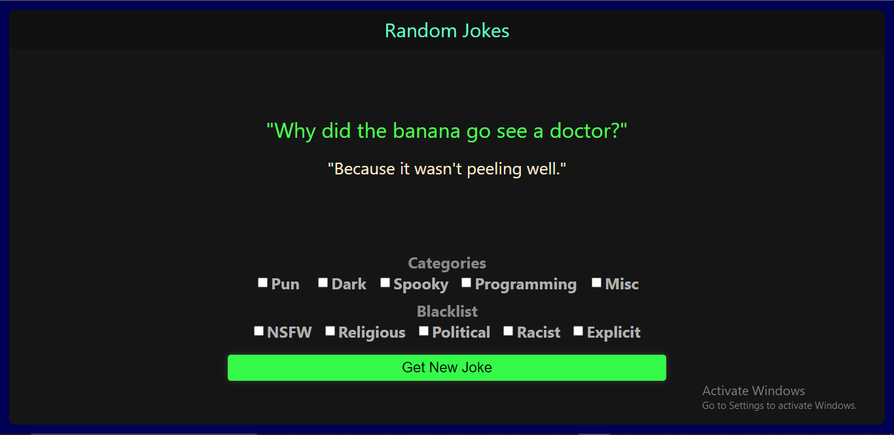

# Random Joke App - React Js

### This is a simple random joke website which is created using React.Js and Jokes API.

> API URL - https://v2.jokeapi.dev/joke/

>[Project Live Link](https://random-jokes-app.vercel.app/)

[Project Live Link](https://random-jokes-app.vercel.app/)

### We can get jokes by categories and also can blacklist specific types of jokes.

## Features to be added
* Copy the joke to clipboard
* UI Improvements